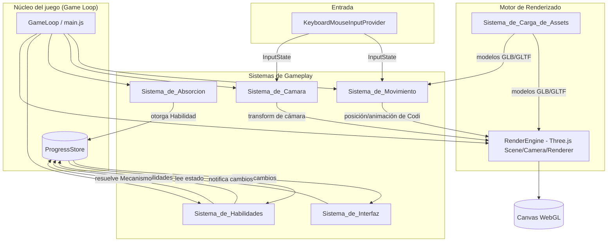
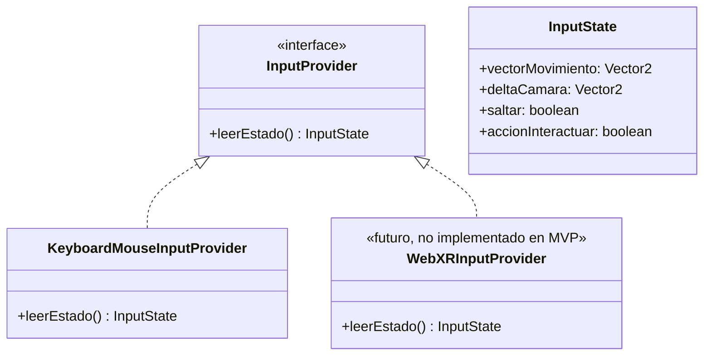
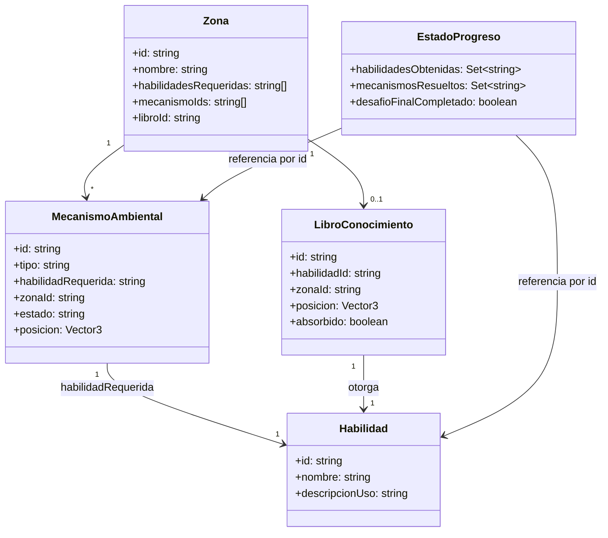

# Documento de Diseño Técnico

## Overview

"Codi y la Biblioteca Perdida del Código" es un juego de exploración 3D en tercera persona construido sobre **Three.js + Vite**, ejecutado enteramente en el navegador mediante WebGL. El diseño técnico prioriza tres objetivos, en este orden: (1) ser realizable por un equipo pequeño en 24-48 horas efectivas, (2) mantener una separación de responsabilidades suficiente para que la Habilidad de escalar a WebXR sea real sin sobre-ingeniería, y (3) representar fielmente la filosofía "programar es resolver problemas, no combatir" en cada subsistema.

El juego se organiza como un **bucle de juego single-threaded** (`requestAnimationFrame`) que actualiza, en cada frame, un conjunto de sistemas desacoplados que leen y escriben sobre un **estado central de progreso** (fuente única de verdad) y sobre la escena de Three.js. No hay backend: todo el estado vive en memoria durante la Sesion_de_Juego y se descarta al recargar la página, como exige el Requisito 9.

Este documento cubre:
- La arquitectura de alto nivel y el flujo de datos entre sistemas.
- El contrato (interfaz) de cada componente mencionado en el glosario de requirements.md.
- Los modelos de datos para Habilidades, Mecanismos_Ambientales, Zonas y el estado de Progreso.
- Las propiedades de corrección que guiarán las pruebas basadas en propiedades (PBT) de la lógica pura del juego.
- La estrategia de manejo de errores y de pruebas.

### Decisiones técnicas clave y justificación

| Decisión | Alternativas consideradas | Justificación |
|---|---|---|
| **Three.js + Vite** como stack de desarrollo | Three.js vanilla sin bundler + Live Server como servidor principal | Vite da HMR (recarga instantánea al editar código/shaders), resolución de módulos ES y `import` de assets GLB de forma nativa, lo cual acelera drásticamente la iteración en una hackatón. Live Server no soporta módulos ES ni bundling, y se relega a un rol complementario (verificación rápida de un asset GLB aislado en un HTML mínimo), nunca como servidor de la app completa. |
| **Colisión manual (raycasts + AABB/esferas)** en vez de un motor de físicas (cannon-es, rapier, ammo.js) | Integrar un motor de físicas real | El juego no necesita física realista (sin gravedad compleja, sin cuerpos rígidos que interactúan entre sí, sin combate). Los requisitos de colisión son: no atravesar geometría, detectar contacto con libros/mecanismos, y detectar suelo bajo los pies. Todo esto se resuelve con raycasts verticales/horizontales contra un conjunto acotado de volúmenes (AABB para estructuras, esferas para el propio Codi y para triggers de contacto). Integrar un motor de físicas añade una curva de aprendizaje, peso de bundle y superficie de bugs que no se justifica en 24-48 horas, y además complica el control de movimiento "arcade" que se busca (más parecido a Mario/Astro Bot que a una simulación física). |
| **InputProvider desacoplado** para movimiento y cámara | Leer teclado/mouse directamente dentro de `Sistema_de_Movimiento`/`Sistema_de_Camara` | El Requisito de "Arquitectura escalable a WebXR" exige que estos dos sistemas no dependan de la fuente de entrada concreta. Se define una interfaz `InputProvider` que expone un estado de entrada abstracto (`InputState`: vector de movimiento, deltas de rotación de cámara, flags de acción) independiente del dispositivo. En el MVP existe una única implementación (`KeyboardMouseInputProvider`); en el futuro, una `WebXRInputProvider` podría implementar la misma interfaz sin tocar `Sistema_de_Movimiento` ni `Sistema_de_Camara`. |
| **Estado de progreso centralizado en memoria (store simple, sin librería externa)** | Redux/Zustand/otra librería de estado | El estado a manejar es pequeño (conjunto de habilidades, conjunto de mecanismos resueltos, flags del desafío final). Un store propio minimalista (patrón observador simple) es suficiente, evita una dependencia más, y es trivial de testear como funciones puras. |
| **Shader/material de corrupción para el Bug_Supremo** en vez de modelo 3D animado propio | Modelar y animar un personaje "Bug_Supremo" | Ahorra el mayor riesgo de producción de assets (Riesgo 1 y 8 en requirements.md). Un `ShaderMaterial`/`onBeforeCompile` que distorsiona vértices y color sobre geometría del entorno ya existente comunica "corrupción" sin requerir rigging ni animación adicional, y es coherente con la idea de que el Bug_Supremo "corrompe" el conocimiento, no que es un monstruo físico. |
| **Assets de terceros (Mixamo, Sketchfab, Poly Pizza) en GLB/GLTF**, cargados vía `GLTFLoader` con `DRACOLoader` opcional | Modelado 3D original | El tiempo de hackatón no permite producir assets originales de calidad. Se diseña el `Sistema_de_Carga_de_Assets` para tolerar la heterogeneidad de estas fuentes (distintas convenciones de escala, nombres de huesos/animaciones, ejes "up") mediante una capa de normalización por asset (ver Componentes). |

## Architecture

### Vista de alto nivel



### Flujo del bucle de juego

```mermaid
sequenceDiagram
    participant Loop as GameLoop (rAF)
    participant Input as InputProvider
    participant Mov as Sistema_de_Movimiento
    participant Cam as Sistema_de_Camara
    participant Abs as Sistema_de_Absorcion
    participant Hab as Sistema_de_Habilidades
    participant Prog as ProgressStore
    participant UI as Sistema_de_Interfaz
    participant Ren as RenderEngine

    loop cada frame (deltaTime)
        Loop->>Input: leerEstado()
        Input-->>Loop: InputState
        Loop->>Mov: actualizar(inputState, deltaTime, mundo)
        Mov-->>Loop: nuevaPose(Codi)
        Loop->>Cam: actualizar(inputState, deltaTime, poseCodi, mundo)
        Cam-->>Loop: nuevoTransform(Camara)
        Loop->>Abs: revisarContacto(poseCodi, librosActivos)
        Abs->>Prog: otorgarHabilidad(id) [si aplica]
        Loop->>Hab: revisarInteraccion(poseCodi, mecanismosCercanos, Prog)
        Hab->>Prog: marcarResuelto(mecanismoId) [si aplica]
        Prog-->>UI: onChange(estado)
        Loop->>Ren: render(escena, camara)
    end
```

### Capa de abstracción de entrada (preparación WebXR)

`Sistema_de_Movimiento` y `Sistema_de_Camara` **nunca** leen `window` eventos de teclado/mouse directamente. Ambos reciben, cada frame, un objeto `InputState` inmutable producido por un `InputProvider`:



Esta es la `Arquitectura_WebXR_Preparada`: no se implementa entrada, renderizado estereoscópico ni sesión WebXR en el MVP, pero `Sistema_de_Movimiento`, `Sistema_de_Camara` y el `RenderEngine` (que ya usa `renderer.setAnimationLoop` en vez de un `requestAnimationFrame` manual, forma compatible con `XRSession`) quedan listos para que una futura `WebXRInputProvider` y una extensión del `RenderEngine` activen una sesión WebXR sin modificar la lógica central.

### Estructura de carpetas del proyecto

```
biblioteca-perdida-de-codi/
├── index.html
├── package.json
├── vite.config.js
├── public/
│   └── assets/                  # Assets estáticos servidos tal cual (no procesados por Vite)
│       ├── models/
│       │   ├── codi/            # codi.glb + variantes de animación (Mixamo re-targeteadas)
│       │   ├── entorno/         # islas, zonas, mecanismos (Sketchfab/Poly Pizza)
│       │   └── bug-supremo/     # solo texturas/geometría base a corromper, sin modelo propio
│       └── textures/
├── src/
│   ├── main.js                  # Punto de entrada: crea GameLoop y arranca
│   ├── core/
│   │   ├── GameLoop.js
│   │   ├── ProgressStore.js
│   │   └── EventBus.js          # pub/sub simple para eventos de UI (opcional, ligero)
│   ├── input/
│   │   ├── InputProvider.js     # interfaz + InputState (JSDoc typedef)
│   │   └── KeyboardMouseInputProvider.js
│   ├── movement/
│   │   ├── MovementSystem.js
│   │   └── collision.js         # funciones puras de colisión (AABB/esferas/raycast)
│   ├── camera/
│   │   └── CameraSystem.js
│   ├── absorption/
│   │   └── AbsorptionSystem.js
│   ├── abilities/
│   │   ├── AbilitySystem.js
│   │   └── mechanismDefinitions.js
│   ├── ui/
│   │   ├── UISystem.js
│   │   └── messages.js          # generación pura de textos contextuales
│   ├── rendering/
│   │   ├── RenderEngine.js
│   │   └── corruptionShader.js  # ShaderMaterial del Bug_Supremo
│   ├── assets/
│   │   └── AssetLoader.js       # wrapper de GLTFLoader + normalización
│   ├── world/
│   │   ├── zones.data.js        # definición declarativa de Zonas/Mecanismos
│   │   └── WorldModel.js        # tipos y validación de esquema del mundo
│   └── config/
│       └── constants.js         # velocidades, límites de cámara, radios de contacto, etc.
├── tests/
│   ├── unit/
│   └── property/
└── docs/
    └── assets-licencias.md      # registro de licencias de assets de terceros
```

**Convención de nombres de assets** (documentada aquí para el equipo, responde a la pregunta abierta 2 de requirements.md): `public/assets/models/<categoria>/<nombre-en-kebab-case>.glb`, con animaciones embebidas en el mismo GLB cuando sea posible (exportación única desde Mixamo con clips nombrados `idle`, `walk`, `run`, `jump`, `absorb`).

## Components and Interfaces

Cada componente corresponde a un subsistema nombrado en el glosario de requirements.md. Se describen como interfaces/pseudocódigo de alto nivel, no como implementación final.

### InputProvider / KeyboardMouseInputProvider

```javascript
/**
 * @typedef {Object} InputState
 * @property {{x:number, z:number}} vectorMovimiento  // normalizado, [-1,1] por eje
 * @property {{x:number, y:number}} deltaCamara        // delta de mouse del frame, en px o rad
 * @property {boolean} saltar                          // flag "borde de subida" (edge-triggered)
 * @property {boolean} accionInteractuar                // usar/consultar mecanismo cercano
 */

class InputProvider {
  leerEstado() /* : InputState */ { throw new Error('no implementado'); }
}

class KeyboardMouseInputProvider extends InputProvider {
  // Traduce eventos DOM (keydown/keyup/mousemove) acumulados desde el último frame
  // a un InputState normalizado e independiente del dispositivo.
  leerEstado() { /* ... */ }
}
```

### Sistema_de_Movimiento (MovementSystem)

Responsable de traducir `InputState` + `deltaTime` en una nueva pose de Codi, resolviendo colisiones contra el `WorldModel`.

```javascript
class MovementSystem {
  /**
   * @param {InputState} inputState
   * @param {number} deltaTime
   * @param {CodiPose} poseActual
   * @param {WorldModel} mundo
   * @returns {CodiPose} nuevaPose  // { position, rotationY, velocity, animState, lastSafePosition }
   */
  actualizar(inputState, deltaTime, poseActual, mundo) { /* ... */ }
}
```

Lógica interna (pseudocódigo):
1. Calcular `desplazamientoDeseado = vectorMovimiento * velocidad * deltaTime`, rotado según orientación de cámara.
2. Resolver colisión horizontal: para cada volumen sólido del `WorldModel` cercano, si `posicionCandidata` intersecta un AABB/esfera, recortar el desplazamiento en el eje correspondiente (deslizamiento contra la pared, no detención total).
3. Resolver suelo: raycast vertical hacia abajo desde la posición candidata; si hay salto en curso, aplicar física simple de proyectil (velocidad vertical - gravedad*deltaTime); si no, adherir a la altura del terreno detectada.
4. Si la posición resultante cae fuera de los límites navegables (ningún suelo detectado por debajo de un umbral), devolver `lastSafePosition` en su lugar.
5. Si la posición resultante entra en una `Zona_Bloqueada` (ver `AbilitySystem.puedeAcceder`), cancelar el desplazamiento hacia esa zona (mismo tratamiento que colisión con pared invisible).
6. Seleccionar `animState` puro a partir de la magnitud de velocidad resultante (`idle | walk | run | jump`).
7. Si la posición está sobre una plataforma móvil activa, sumar el delta de movimiento de la plataforma a la posición de Codi (mantiene a Codi "pegado" sin expulsarlo).

### Sistema_de_Camara (CameraSystem)

```javascript
class CameraSystem {
  /**
   * @param {InputState} inputState
   * @param {number} deltaTime
   * @param {CodiPose} poseCodi
   * @param {WorldModel} mundo
   * @param {CameraState} estadoActual  // { yaw, pitch, distanciaActual }
   * @returns {CameraState} nuevoEstado
   */
  actualizar(inputState, deltaTime, poseCodi, mundo, estadoActual) { /* ... */ }
}
```

Lógica interna:
1. `yaw += deltaCamara.x * sensibilidad`; `pitch = clamp(pitch + deltaCamara.y * sensibilidad, pitchMin, pitchMax)`.
2. Calcular posición ideal de cámara en órbita alrededor de `poseCodi.position` a `distanciaIdeal`.
3. Raycast desde `poseCodi.position` hacia la posición ideal de cámara; si el rayo intersecta geometría del `mundo` antes de llegar a `distanciaIdeal`, usar `distanciaActual = distanciaInterseccion - margen`.
4. Al redimensionar el viewport, recalcular `aspect = ancho/alto` y actualizar `camera.updateProjectionMatrix()` sin tocar el FOV vertical.

### Sistema_de_Absorcion (AbsorptionSystem)

```javascript
class AbsorptionSystem {
  /**
   * @param {CodiPose} poseCodi
   * @param {LibroConocimiento[]} librosActivos
   * @param {ProgressStore} progreso
   * @returns {{ habilidadOtorgada: string|null, libroRemovidoId: string|null }}
   */
  revisarContacto(poseCodi, librosActivos, progreso) {
    for (const libro of librosActivos) {
      if (libro.absorbido) continue; // idempotencia: 3.5
      if (distancia(poseCodi.position, libro.position) <= RADIO_CONTACTO) {
        if (!progreso.tieneHabilidad(libro.habilidadId)) {
          progreso.otorgarHabilidad(libro.habilidadId);
        }
        libro.absorbido = true; // 3.4: se remueve de la escena/lista activa
        return { habilidadOtorgada: libro.habilidadId, libroRemovidoId: libro.id };
      }
    }
    return { habilidadOtorgada: null, libroRemovidoId: null };
  }
}
```

### Sistema_de_Habilidades (AbilitySystem)

Responsable del "gating" (activar/consultar solo si se posee la Habilidad) y de las transiciones de estado de `Mecanismo_Ambiental` y `Zona`.

```javascript
class AbilitySystem {
  /** @returns {boolean} */
  puedeInteractuar(mecanismo, progreso) {
    return progreso.tieneHabilidad(mecanismo.habilidadRequerida);
  }

  /** @returns {boolean} */
  puedeAcceder(zona, progreso) {
    return zona.habilidadesRequeridas.every(h => progreso.tieneHabilidad(h));
  }

  /**
   * @returns {{ resultado: 'resuelto'|'sin-cambio'|'denegado', mensaje?: string }}
   */
  interactuar(mecanismo, progreso) {
    if (!this.puedeInteractuar(mecanismo, progreso)) {
      return { resultado: 'denegado', mensaje: mensajeCarencia(mecanismo.habilidadRequerida) };
    }
    if (mecanismo.estado === 'resuelto') {
      return { resultado: 'sin-cambio' }; // idempotencia: 4.4
    }
    mecanismo.estado = 'resuelto';
    progreso.marcarMecanismoResuelto(mecanismo.id);
    return { resultado: 'resuelto', mensaje: mensajeExito(mecanismo) };
  }
}
```

Todos los tipos de mecanismo (`puente`, `solucion-automatizada`, `dispositivo`, `plataforma-movil`, `camino-oculto`, `fuente-informacion`) comparten esta misma máquina de estados de dos valores (`bloqueado` → `resuelto`); lo que cambia entre tipos es únicamente el efecto visual/de escena disparado al resolverse (extender puente, iniciar recorrido de plataforma, revelar geometría oculta), no la lógica de gating.

### Sistema_de_Interfaz (UISystem)

Renderiza sobre HTML/CSS superpuesto al canvas (no dentro de la escena 3D), para simplicidad y accesibilidad de texto (contraste, tamaño).

```javascript
class UISystem {
  /** Deriva las props a renderizar a partir del estado; función pura, sin acceso a DOM */
  construirVista(progreso) {
    return {
      habilidadesObtenidas: progreso.habilidades(), // exactamente el conjunto actual
      mensajeActivo: progreso.mensajeActivo(),       // { texto, expiraEn } | null
    };
  }
}

/** Función pura de generación de texto, testeable sin DOM */
function generarMensaje(evento) { /* mapea evento -> string no vacío, tono cálido */ }
```

### Motor_de_Renderizado (RenderEngine)

Encapsula `THREE.Scene`, `THREE.PerspectiveCamera`, `THREE.WebGLRenderer`. Usa `renderer.setAnimationLoop(callback)` (en vez de `requestAnimationFrame` manual) precisamente porque esta API es la misma que Three.js reutiliza al entrar en una `XRSession`, lo que evita reescribir el bucle de render al añadir WebXR en el futuro.

```javascript
class RenderEngine {
  constructor(canvas) { /* crea scene/camera/renderer, listeners de resize */ }
  registrarModelo(objeto3D) { /* añade a la escena */ }
  aplicarCorrupcion(mallaObjetivo, intensidad) { /* asigna/actualiza corruptionShader */ }
  render(poseCodi, estadoCamara) { /* posiciona objetos y renderiza un frame */ }
}
```

El shader de corrupción del Bug_Supremo (`corruptionShader.js`) es un `ShaderMaterial` (o `onBeforeCompile` sobre el material existente) que distorsiona vértices con ruido y desatura/tiñe el color, aplicado sobre mallas del entorno ya cargadas — nunca sobre una malla propia del Bug_Supremo.

### Sistema_de_Carga_de_Assets (AssetLoader)

```javascript
class AssetLoader {
  /**
   * @param {AssetManifestEntry[]} manifiesto
   * @returns {Promise<Map<string, THREE.Object3D>>}
   */
  async cargarTodos(manifiesto, onProgreso) {
    // usa GLTFLoader (+ DRACOLoader opcional) por entrada del manifiesto,
    // aplica normalizarEscalaYEjes(entry) para compensar diferencias entre
    // fuentes heterogéneas (Mixamo/Sketchfab/Poly Pizza), y agrega manejo
    // de error por asset (ver Error Handling) sin abortar la carga completa
    // de los demás assets.
  }
}
```

`normalizarEscalaYEjes` es el punto de adaptación explícito para assets de terceros: cada entrada del manifiesto declara un factor de escala y una corrección de rotación conocidos de antemano (determinados una vez, manualmente, al integrar cada asset), evitando "magia" en tiempo de ejecución.

### ProgressStore (soporta Sistema_de_Progreso)

```javascript
class ProgressStore {
  constructor() {
    this._habilidades = new Set();
    this._mecanismosResueltos = new Set();
    this._desafioCompletado = false;
    this._listeners = [];
  }
  tieneHabilidad(id) { return this._habilidades.has(id); }
  habilidades() { return new Set(this._habilidades); } // snapshot inmutable
  otorgarHabilidad(id) { this._habilidades.add(id); this._notificar(); }
  marcarMecanismoResuelto(id) { this._mecanismosResueltos.add(id); this._notificar(); }
  marcarDesafioCompletado() { this._desafioCompletado = true; this._notificar(); }
  suscribir(fn) { this._listeners.push(fn); }
  _notificar() { this._listeners.forEach(fn => fn(this)); }
}
```

Al ser la única fuente de verdad leída por `UISystem`, `AbilitySystem` y `MovementSystem` (para el gating de `Zona_Bloqueada`), se cumple el Requisito funcional 4 (consistencia de estado expuesto a los demás subsistemas) por construcción: no existen copias del estado, solo referencias al mismo `ProgressStore`.

## Data Models



### Habilidad

```typescript
type HabilidadId = 'python' | 'javascript' | 'sql';

interface Habilidad {
  id: HabilidadId;
  nombre: string;              // "Python", "JavaScript", "SQL"
  descripcionUso: string;      // texto corto mostrado en el mensaje de absorción (3.3)
}
```

Catálogo fijo del MVP (exactamente 3 entradas, Requisito "Alcance del MVP" ítem 5).

### Mecanismo_Ambiental

```typescript
type TipoMecanismo =
  | 'puente'                 // Python
  | 'solucion-automatizada'  // Python
  | 'dispositivo'            // JavaScript
  | 'plataforma-movil'       // JavaScript
  | 'camino-oculto'          // SQL
  | 'fuente-informacion';    // SQL

type EstadoMecanismo = 'bloqueado' | 'resuelto';

interface MecanismoAmbiental {
  id: string;
  tipo: TipoMecanismo;
  habilidadRequerida: HabilidadId;   // exactamente una (Requisito funcional 6)
  zonaId: string;
  estado: EstadoMecanismo;
  posicion: { x: number; y: number; z: number };
  // datos específicos del tipo, opcionales según 'tipo':
  puntoA?: Vector3;                  // plataforma-movil / puente
  puntoB?: Vector3;
  objetivoRevelacionId?: string;     // camino-oculto: id del objeto de escena a mostrar
}
```

Invariante de esquema (validado al cargar `zones.data.js`): todo `MecanismoAmbiental` tiene exactamente un `habilidadRequerida` perteneciente al catálogo de `Habilidad`.

### Zona

```typescript
interface Zona {
  id: string;
  nombre: string;
  habilidadesRequeridas: HabilidadId[]; // [] para zonas iniciales; puede tener 1 (zona bloqueada normal) o 3 (zona del Desafio_Final)
  mecanismoIds: string[];
  libroId?: string;                     // opcional: no toda zona tiene un Libro_de_Conocimiento
  limites: { min: Vector3; max: Vector3 }; // AABB grueso de la zona, usado para el gating espacial
}
```

### Libro_de_Conocimiento

```typescript
interface LibroConocimiento {
  id: string;
  habilidadId: HabilidadId;
  zonaId: string;
  posicion: Vector3;
  absorbido: boolean; // false al iniciar la Sesion_de_Juego
}
```

### Estado de Progreso (EstadoProgreso)

```typescript
interface EstadoProgreso {
  habilidadesObtenidas: Set<HabilidadId>;   // monótonamente creciente durante la sesión
  mecanismosResueltos: Set<string>;         // monótonamente creciente durante la sesión
  desafioFinalCompletado: boolean;          // false -> true, nunca vuelve a false
}
```

Este es el modelo que respalda `ProgressStore`. Se reinicia por completo (nueva instancia con conjuntos vacíos y `desafioFinalCompletado = false`) únicamente al arrancar una nueva `Sesion_de_Juego` (recarga de página), nunca durante la sesión misma (Requisito 9.3).

## Correctness Properties

*Una propiedad es una característica o comportamiento que debe cumplirse en todas las ejecuciones válidas del sistema; en esencia, una afirmación formal sobre lo que el sistema debe hacer. Las propiedades sirven como puente entre las especificaciones legibles por humanos y garantías de corrección verificables automáticamente.*

**Reflexión de redundancia realizada:** el prework identificó varias propiedades que comparten el mismo patrón subyacente (gating por habilidad, transición de estado bloqueado→resuelto, monotonía del progreso). Se consolidaron así:
- El gating de Mecanismos (4.1/4.3, 5.1/5.3, 6.1/6.3) y el gating de Zonas (7.1) y del Desafío Final (10.1) son instancias del mismo patrón "acceso permitido si y solo si el conjunto de habilidades requerido es subconjunto de las habilidades poseídas" → **Property 3**, parametrizada por el tamaño del conjunto requerido (1 para mecanismos/zonas normales, 3 para el desafío final).
- La transición "activar mecanismo bloqueado con la habilidad correcta → resuelto" (4.2, 5.2, 6.2) y la idempotencia de repetir la activación (4.4) son la misma máquina de estados aplicada a los seis tipos de mecanismo → **Property 4**.
- La remoción del libro tras absorción (3.4) es parte del mismo cambio de estado que otorgar la habilidad (3.1) → combinadas en **Property 1**.
- La idempotencia de re-absorber un libro ya absorbido (3.5) es un caso particular de **Property 1** (f(f(x)) == f(x)) → **Property 2**.
- El registro permanente de mecanismos resueltos (6.4), la monotonía de habilidades/mecanismos durante la sesión (9.1, 9.2) y la persistencia de acceso a zonas ya desbloqueadas (7.3) son la misma propiedad de monotonía del `EstadoProgreso` → **Property 8**.
- El estado inicial vacío de una nueva sesión (9.3) se mantiene como propiedad independiente porque cuantifica sobre "toda instancia nueva", no sobre transiciones → **Property 9**.

### Property 1: Absorción otorga habilidad y remueve el libro

*Para cualquier* `LibroConocimiento` no absorbido y cualquier `EstadoProgreso` que no posea aún su `habilidadId`, al procesar un contacto entre Codi y ese libro, el `EstadoProgreso` resultante debe contener `habilidadId`, y el libro debe quedar marcado `absorbido = true` (excluido de los libros activos de la escena).

**Validates: Requirements 3.1, 3.4**

### Property 2: Absorción es idempotente

*Para cualquier* `LibroConocimiento` cuya `habilidadId` ya está presente en el `EstadoProgreso` (por absorción propia o de otro libro de la misma habilidad), procesar un nuevo contacto con dicho libro no debe alterar el `EstadoProgreso` ni ningún otro libro de la escena.

**Validates: Requirements 3.5**

### Property 3: Gating por conjunto de habilidades requeridas

*Para cualquier* objetivo interactivo (Mecanismo_Ambiental, Zona o el Desafío_Final) con un conjunto de habilidades requeridas `R`, y cualquier `EstadoProgreso` con conjunto de habilidades `P`, la interacción/acceso debe permitirse si y solo si `R ⊆ P`; si `R ⊄ P`, el sistema debe producir un mensaje de carencia que identifique al menos una habilidad faltante, y el estado del objetivo (mecanismo/zona) no debe cambiar.

**Validates: Requirements 4.1, 4.3, 5.1, 5.3, 6.1, 6.3, 7.1, 7.2, 10.1**

### Property 4: Activación exitosa resuelve el mecanismo y es idempotente

*Para cualquier* `MecanismoAmbiental` en estado `bloqueado` y cualquier `EstadoProgreso` que satisfaga `habilidadRequerida ∈ P`, activarlo debe cambiar su estado a `resuelto` y registrar su id en `EstadoProgreso.mecanismosResueltos`. Además, *para cualquier* `MecanismoAmbiental` ya en estado `resuelto`, activarlo de nuevo (con o sin la habilidad) no debe cambiar su estado ni duplicar su registro en `mecanismosResueltos`.

**Validates: Requirements 4.2, 4.4, 5.2, 6.2**

### Property 5: Colisión impide atravesar geometría sólida

*Para cualquier* conjunto de volúmenes sólidos (AABB/esferas) del mundo y cualquier trayectoria de movimiento deseada de Codi, la posición resuelta por `MovementSystem` nunca debe quedar dentro de un volumen sólido.

**Validates: Requirements 1.5**

### Property 6: Reposicionamiento seguro fuera de límites

*Para cualquier* secuencia de posiciones de Codi en la que se registran puntos "seguros" (con suelo navegable detectado) intercalados con posiciones fuera de los límites navegables, cuando se detecta una posición fuera de límites, la posición resultante debe ser igual al último punto seguro registrado antes de esa posición.

**Validates: Requirements 1.4**

### Property 7: Rotación de cámara y aspect ratio

*Para cualquier* `deltaCamara` aplicado, el nuevo `pitch` de la cámara debe permanecer dentro de `[pitchMin, pitchMax]` y el `yaw` debe cambiar en la dirección del delta horizontal (invariante de clamping). *Para cualquier* par de dimensiones de viewport `(ancho, alto)` con `ancho > 0` y `alto > 0`, tras `actualizarAspecto`, la relación de aspecto de la cámara debe ser exactamente `ancho/alto`, sin alterar el FOV vertical configurado.

**Validates: Requirements 2.2, 2.4**

### Property 8: Monotonía del progreso durante la sesión

*Para cualquier* secuencia de eventos válidos aplicados a un `EstadoProgreso` dentro de una misma Sesion_de_Juego (otorgar habilidad, marcar mecanismo resuelto), los conjuntos `habilidadesObtenidas` y `mecanismosResueltos` solo pueden crecer o permanecer iguales; ningún evento válido puede remover un elemento ya presente. Como consecuencia, si una `Zona` o `MecanismoAmbiental` era accesible/resuelto en un punto de la secuencia, debe seguir siéndolo en cualquier punto posterior de la misma sesión.

**Validates: Requirements 6.4, 7.3, 9.1, 9.2**

### Property 9: Estado inicial de una nueva sesión

*Para cualquier* instancia nueva de `ProgressStore` creada al inicio de una Sesion_de_Juego, `habilidadesObtenidas` y `mecanismosResueltos` deben estar vacíos y `desafioFinalCompletado` debe ser `false`.

**Validates: Requirements 9.3**

### Property 10: Cámara evita obstrucción sin atravesar geometría

*Para cualquier* conjunto de obstáculos entre Codi y la posición ideal de cámara, la distancia resuelta de la cámara respecto a Codi debe ser menor o igual a la distancia del primer obstáculo detectado por el raycast (menos un margen), y nunca mayor que la distancia ideal configurada.

**Validates: Requirements 2.3**

### Property 11: Adherencia a plataformas móviles

*Para cualquier* desplazamiento de una `plataforma-movil` activa, si Codi está posicionado sobre su superficie al inicio del frame y no ejecuta una acción de salto/salida, su posición relativa (offset) respecto a la plataforma debe mantenerse constante entre frames.

**Validates: Requirements 5.4**

### Property 12: Consistencia del indicador de habilidades

*Para cualquier* `EstadoProgreso`, la vista construida por `UISystem.construirVista` debe reportar exactamente el conjunto `habilidadesObtenidas` (sin omisiones ni elementos adicionales).

**Validates: Requirements 8.1**

### Property 13: Generación de mensajes contextuales no vacíos y relevantes

*Para cualquier* evento del catálogo soportado (absorción de habilidad, denegación por gating, resolución de mecanismo), `generarMensaje` debe producir un texto no vacío que incluya un identificador legible del elemento involucrado (nombre de la habilidad o de la zona/mecanismo).

**Validates: Requirements 3.3, 8.2**

### Property 14: Validación de esquema de Mecanismo_Ambiental

*Para cualquier* definición de `MecanismoAmbiental` cargada desde los datos del mundo, debe tener exactamente un `habilidadRequerida` perteneciente al catálogo fijo de `Habilidad` (`python | javascript | sql`); definiciones con cero o más de una habilidad asociada deben ser rechazadas por el validador de esquema al cargar el mundo.

**Validates: Requirements 12.6** (Requisitos funcionales, ítem 6)

### Property 15: Consistencia de lectura del ProgressStore

*Para cualquier* secuencia de mutaciones sobre un `ProgressStore`, cualquier lector (`UISystem`, `AbilitySystem`, `MovementSystem`) que consulte el store inmediatamente después de una mutación debe observar el mismo valor que cualquier otro lector que consulte en ese mismo instante (no existen copias divergentes del estado).

**Validates: Requirements 12.4** (Requisitos funcionales, ítem 4)

## Error Handling

| Escenario | Componente responsable | Estrategia |
|---|---|---|
| Falla la carga de un modelo GLB/GLTF (archivo faltante, corrupto, error de red) | `AssetLoader` | Captura el rechazo de `GLTFLoader` por asset individual; no aborta la carga de los demás assets del manifiesto. Registra el error en consola con el id del asset y notifica a `UISystem` para mostrar un mensaje comprensible ("No se pudo cargar un elemento del mundo") en vez de dejar pantalla en blanco (Requisito funcional 2, caso límite 5). Si el modelo de Codi específicamente falla, se muestra una pantalla de error bloqueante (sin él no hay juego jugable). |
| Navegador sin soporte WebGL | `RenderEngine` (chequeo en `main.js` antes de inicializar) | Detectar disponibilidad de contexto WebGL antes de crear el `WebGLRenderer`; si no está disponible, `UISystem` muestra un mensaje explicando el requisito técnico, sin intentar renderizar (Requisito no funcional de compatibilidad, caso límite 8). |
| Codi queda atascado o cae fuera de los límites navegables | `MovementSystem` | Ver Property 6: reposicionamiento automático al último punto seguro registrado; no se considera un error fatal, es un comportamiento normal de recuperación. |
| Intento de interactuar con un Mecanismo/Zona sin la habilidad requerida | `AbilitySystem` + `UISystem` | No es un error del sistema sino un caso de gating esperado (Property 3): se responde con un mensaje informativo, sin modificar estado ni bloquear el resto de la exploración (caso límite 1). |
| Intento de absorber un libro ya absorbido | `AbsorptionSystem` | Ignorado silenciosamente por diseño (Property 2); no se registra como error, solo se omite el efecto (caso límite 2). |
| Llegada a la zona del Desafío_Final sin las tres habilidades | `AbilitySystem` | Se reutiliza el mismo mecanismo de Property 3 (gating con `R` de tamaño 3): se deniega el inicio y `UISystem` explica qué habilidad falta (caso límite 7, Requisito 10 y su relación con Requisito 7). |
| Redimensionamiento de ventana durante el juego | `RenderEngine` / `CameraSystem` | Listener de `resize` recalcula aspect ratio (Property 7) de forma síncrona; no es un estado de error. |
| Recarga de página en cualquier punto de la sesión | Ciclo de vida de la aplicación (`main.js`) | Comportamiento esperado, no un error: se crea una instancia nueva de todo el estado (Property 9), reiniciando desde el punto de inicio fijo (caso límite 9). |
| Excepción no controlada durante el bucle de renderizado | `GameLoop` | Se envuelve el callback de `setAnimationLoop` en un try/catch de nivel superior que detiene el bucle y muestra un mensaje de error genérico en `UISystem`, evitando que un frame roto deje la pantalla congelada sin explicación (extensión defensiva del Requisito "MVP SHALL poder jugarse de principio a fin sin errores que interrumpan la sesión"). |

## Testing Strategy

### Enfoque dual

- **Pruebas unitarias (ejemplo/edge case):** cubren transiciones puntuales y de configuración fija que no varían significativamente con el input: disparo de animación de salto (1.2), secuencia de animación/control tras absorción (3.2), ocultamiento de mensajes tras temporizador (8.3), manejo de errores de carga por tipo de fallo concreto (Requisito funcional 2), posición de inicio fija (Requisito funcional 5), y la validación de que el Desafío_Final concreto (diseño de nivel fijo) usa al menos dos habilidades distintas (10.2) y marca el juego como completado al resolverse (10.4).
- **Pruebas basadas en propiedades (PBT):** cubren la lógica pura de movimiento, colisión, cámara, gating de habilidades, transición de mecanismos y monotonía del progreso — es decir, todo el comportamiento que varía significativamente según el input y donde 100+ iteraciones aleatorias tienen valor real para encontrar casos límite (ver Correctness Properties arriba).
- **Fuera de alcance para pruebas automatizadas:** aspectos de percepción visual/tono (encuadre de cámara "agradable", fidelidad del modelo oficial de Codi, calidez del texto, estilo de animación), infraestructura (WebGL real, `GLTFLoader` contra archivos reales), y rendimiento en hardware real — estos se verifican mediante revisión manual/QA exploratorio, no PBT.

### Librería de PBT

Se usará **fast-check** (librería de property-based testing para JavaScript/TypeScript, integrable con Vitest) ya que el proyecto usa Vite/ESM y Vitest es el runner de pruebas natural en ese ecosistema. No se implementará generación aleatoria de datos a mano.

- Cada test de propiedad se ejecuta con un mínimo de **100 iteraciones** (`fc.assert(fc.property(...), { numRuns: 100 })`).
- Cada test se etiqueta con un comentario con el formato: **Feature: biblioteca-perdida-de-codi, Property {number}: {texto de la propiedad}**.
- Cada Correctness Property de este documento se implementa mediante **un único** test de propiedad (sin duplicar la misma propiedad en varios tests).

### Mapeo Property → Test (resumen)

| Property | Módulo bajo prueba | Generadores clave (fast-check) |
|---|---|---|
| 1, 2 | `AbsorptionSystem` | libros arbitrarios (con/sin `absorbido`), estados de progreso arbitrarios |
| 3 | `AbilitySystem.puedeInteractuar` / `puedeAcceder` | subconjuntos arbitrarios de habilidades requeridas vs. poseídas |
| 4 | `AbilitySystem.interactuar` | mecanismos arbitrarios en ambos estados, secuencias de activación repetida |
| 5, 6 | `movement/collision.js` | volúmenes AABB/esfera arbitrarios, trayectorias arbitrarias, secuencias de posiciones seguras/inseguras |
| 7, 10 | `CameraSystem` | deltas de input arbitrarios, dimensiones de viewport arbitrarias, obstáculos arbitrarios |
| 8, 9 | `ProgressStore` | secuencias arbitrarias de eventos válidos; instancias nuevas |
| 11 | `MovementSystem` (interacción con plataformas) | desplazamientos arbitrarios de plataforma, offsets iniciales arbitrarios |
| 12, 13 | `UISystem`, `messages.js` | estados de progreso arbitrarios, eventos arbitrarios del catálogo |
| 14 | `WorldModel` (validador de esquema) | definiciones de mecanismo arbitrarias, válidas e inválidas |
| 15 | `ProgressStore` | secuencias arbitrarias de mutaciones intercaladas con lecturas de múltiples "lectores" simulados |

### Pruebas de integración / smoke (no PBT)

- Smoke test: la app arranca, detecta WebGL, y llega a mostrar el primer frame renderizado sin excepciones.
- Integración: `AssetLoader` contra un manifiesto con un asset intencionalmente inválido → se produce el mensaje de error esperado sin abortar la carga de los demás.
- Integración: recorrido guionado end-to-end (obtener las 3 habilidades → resolver el Desafío_Final) ejecutado manualmente como criterio de aceptación general del MVP.
