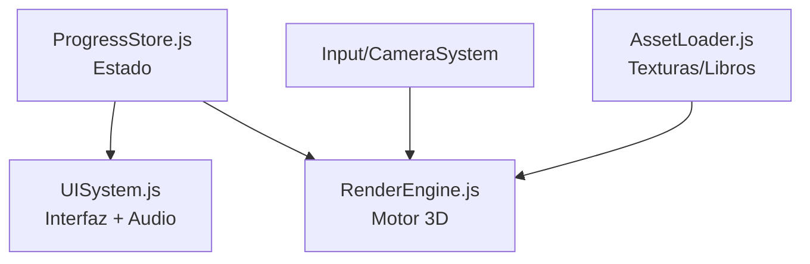
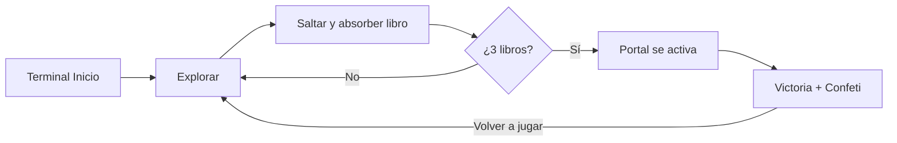

# 🐊 La Biblioteca Perdida de Codi


Videojuego 3D de plataformas y exploración construido con **Three.js** y **Kiro**, para la Hackathon **AWS + Código Facilito**. El jugador controla a **Codi**, quien debe recorrer una isla flotante, recuperar tres libros de conocimiento (**Python, JavaScript, SQL**) y cruzar el Portal de Restauración para salvar la Biblioteca.

🔗 **Demo en vivo:** [Netlify](#) — *(reemplazar con tu enlace)*
📦 **Repositorio:** [AngelTroncoso/kiro_codigofacilito](https://github.com/AngelTroncoso/kiro_codigofacilito)

---

## ✨ Características

- **Motor Zero-Asset:** texturas AWS, palmeras, libros 3D y audio se generan 100% por código (Canvas API + Web Audio API), sin archivos externos → build < 1 MB.
- **Circuito guiado en línea recta** con salto para recolectar libros flotantes.
- **Narrativa:** diálogos de gratitud al absorber cada libro; portal final con confeti y fanfarria.
- **Jury Demo Mode:** atajos de teclado para presentación en vivo.

## 🕹️ Controles

| Tecla | Acción |
|---|---|
| `W A S D` / Flechas | Mover a Codi |
| `Espacio` | Saltar |
| `E` | Absorber libro / interactuar |
| Mouse | Rotar cámara |
| `🎯` (HUD) | Centrar cámara detrás de Codi |

## 🔑 Atajos para el jurado

| Tecla | Acción |
|---|---|
| `K` | Victoria instantánea |
| `R` | Reiniciar demo |
| `M` | Velocidad x2 |

## 🏗️ Arquitectura



## 🔄 Core Loop



## ☁️ AWS y Kiro

- Desarrollado íntegramente con **Kiro IDE** (prompts de especificación técnica).
- Identidad visual de AWS integrada como texturas emisivas en el escenario.
- Preparado para desplegar en **AWS Amplify Hosting**; actualmente en **Netlify**.

## 🚀 Instalación local

```bash
git clone https://github.com/AngelTroncoso/kiro_codigofacilito.git
cd biblioteca-perdida-de-codi
npm install
npm run dev      # http://localhost:5173
npm run build    # build de producción
npm test         # 165 tests
```

## 📁 Stack

Three.js · JavaScript ES6 · Vite · Vitest · Web Audio API
